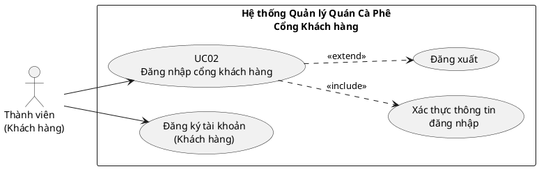

# UC02 - Đăng nhập cổng khách hàng

**Mã Use Case:** UC02  
**Tên Use Case:** Đăng nhập cổng khách hàng

---

## Thông tin cơ bản

| Thuộc tính              | Nội dung |
|-------------------------|----------|
| **Mã Use Case**         | UC02 |
| **Tên Use Case**        | Đăng nhập cổng khách hàng |
| **Tác nhân (Actor)**    | Thành viên (KhachHang) |
| **Mức độ ưu tiên**      | Cao |
| **Trạng thái**          | Hoàn thành |

---

## Mô tả

Nếu muốn sử dụng những tính năng đặc thù của hệ thống, phải thực hiện thao tác đăng nhập vào hệ thống thành công. 

**Lưu ý quan trọng:** Đối với tài khoản của nhân viên, thì sẽ do người quản trị viên thêm vào chứ không thể đăng ký như người dùng.

---

## Điều kiện

| Loại                  | Nội dung |
|-----------------------|----------|
| **Điều kiện tiên quyết (Precondition)** | Phải đăng ký thành công tài khoản trên hệ thống. |
| **Điều kiện hậu quả (Postcondition)** | Người dùng được xác thực thành công và chuyển hướng đến trang chủ khách hàng (cổng khách). |

---

## Luồng chính (Main Flow)

1. Người dùng truy cập trang Đăng nhập cổng khách hàng.
2. Nhập **Tên đăng nhập / SĐT / Email** và **Mật khẩu**.
3. Nhấn nút “Đăng nhập”.
4. Hệ thống kiểm tra thông tin đăng nhập.
5. Hệ thống xác thực thành công và cấp session.
6. Chuyển hướng đến trang chủ khách hàng.

---

## Luồng ngoại lệ (Exception Flows)

- **Sai tên đăng nhập hoặc mật khẩu** → Hiển thị lỗi “Tên đăng nhập hoặc mật khẩu không đúng”.
- **Tài khoản bị khóa hoặc chưa kích hoạt** → Hiển thị thông báo tương ứng.
- **Lỗi hệ thống** → Hiển thị lỗi chung.

---

## Biểu đồ Use Case

Xem file PlantUML chi tiết:

- **[UC02_DangNhap_CongKhachHang.puml](UC02_DangNhap_CongKhachHang.puml)**

### Sơ đồ Use Case (tóm tắt)

---

## Ghi chú bổ sung (từ phân tích hệ thống)

- Use Case này chỉ áp dụng cho **cổng khách hàng** (`/TaiKhoan/DangNhap`).
- Tài khoản nhân viên/quản trị **không được phép** đăng nhập qua cổng này (hệ thống sẽ báo lỗi và hướng dẫn sang cổng quản trị).
- Sau khi đăng ký thành công, hệ thống sẽ tự động chuyển về trang đăng nhập kèm thông báo.

---

**Phiên bản tài liệu:** 1.0  
**Ngày cập nhật:** 2026-06-12
